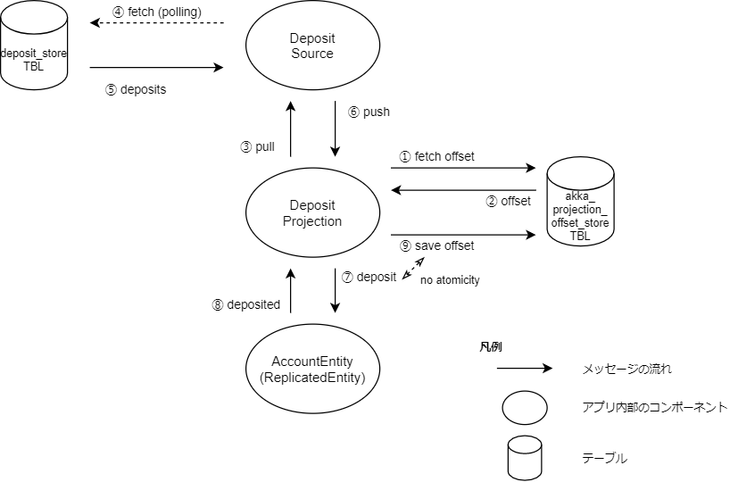

# lerna-sample-account-app

Lerna Stack 向けの「銀行口座」アプリケーションのサンプルです。

[akka-entity-replication](https://github.com/lerna-stack/akka-entity-replication) (HA library) を用いており、より上位の可用性を実現します。

## Provisioning environment

`docker-compse` を使用して開発環境を準備できます。

開発環境を構築するには次のコマンドを実行します。  
これによって `MariaDB` と `Cassandra` が起動します。

```shell
docker-compose up
```

開発環境で動くサーバ(`MariaDB`等)を停止するには次のコマンドを実行します。

```shell
docker-compose down
```

開発環境を破棄するには次のコマンドを実行します。  
このコマンドで開発環境のデータベースの内容がすべて破棄されます。

```shell
docker-compose down --volumes
```

## Getting started

次のコマンドを実行することで、
コンパイルとユニットテストを実行できます。
ユニットテストを実行するためには開発環境を構築しておく必要があります。

```shell
sbt clean test:compile test
```

アプリサーバを実行するには次の2つのコマンドを別々のシェルで実行します。

```shell
# アプリサーバ1を起動します
./scripts/start-app-1.sh
```

```
# アプリサーバ2を起動します
./scripts/start-app-2.sh
```


## 口座の仕様

口座には残高があります。  
口座はテナントと口座番号によって一意に識別できます。

口座に対して次の操作を実行できます。
* [残高確認](#残高確認)
* [入金](#入金)
  * 口座の残高には上限が設定されています。  
    残高上限は 10,000,000 です。  
    上限を超えるような入金を行うことはできません。
* [出金](#出金)
  * 口座の残高が0未満になるような出金を行うことはできません。
* [返金](#返金)
  * 返金によって口座残高が上限を超えることがあります。
* [入出金明細出力](#入出金明細出力)
* [送金](#送金)
  * 送金によって送金元口座の残高が不足する場合には送金できません。
  * 送金によって送金先口座の残高が上限を超える場合には送金できません。

### 冪等性を保証するための取引ID

入金、出金、返金には、冪等性を保証するために ID を指定します。  
この ID を、*取引ID* と呼びます。

取引ID は、入金や出金などの用途ごとに区別されないことに注意してください。  
例えば、*取引ID=1* で入金し、*取引ID=1* で出金するようなことは**できません**。


## API

アプリサーバ1(`127.0.0.1`)にリクエストを送る例です。

```shell
# OKが返ります
curl --silent --noproxy "*" http://127.0.0.1:9001/index

# アプリバージョンを取得します
# デフォルトでは unknown になっています
# 設定ファイルや環境変数で上書きすることができます
curl --silent --noproxy "*" http://127.0.0.1:9002/version

# アプリコミットハッシュを取得します
# デフォルトでは unknown になっています
# 設定ファイルや環境変数で上書きすることができます
curl --silent --noproxy "*" http://127.0.0.1:9002/commit-hash
```

アプリサーバ2(`127.0.0.2`)にリクエストを送る場合はIPアドレスを変更します。

```
curl --silent --noproxy "*" http://127.0.0.2:9001/index
curl --silent --noproxy "*" http://127.0.0.2:9002/version
curl --silent --noproxy "*" http://127.0.0.2:9002/commit-hash
```

ポート番号 `9001` は ユーザ向け機能、  
ポート番号 `9002` は 管理用機能を定義することを想定しています。

### Bank Accounts
#### 残高確認
残高を確認できます。

残高を取得できた場合は、HTTPステータスコード 200 OK と 口座残高 を返します。
残高取得でタイムアウトが発生した場合には、HTTPステータスコード 503 ServiceUnavailable を返します。

- method: `GET`
- path: `/accounts/${accountNo}`
- headers
    - テナント: `X-Tenant-Id`: `${tenantId}`
      - `tenant-a`
      - `tenant-b`

```shell
curl \
    --silent \
    --show-error \
    --request 'GET' \
    --url 'http://127.0.0.1:9001/accounts/test33' \
    --header 'X-Tenant-Id: tenant-a'
```


#### 入金
口座に指定金額を入金できます。

入金に成功すると、HTTPステータスコード 200 OK と 入金後の口座残高 を返します。
残高超過となるような場合には、HTTPステータスコード 400 BadRequest を返します。
入金処理でタイムアウトが発生した場合には、HTTPステータスコード 503 ServiceUnavailable を返します。

入金でタイムアウトが発生した場合には、同じ 取引ID を指定してリトライすることができます。
取引ID により冪等性が保証されています。
同じ 取引ID を指定して リトライする場合、前回とまったく同じ入金金額を指定してください。
異なる入金金額を指定して成功が返った場合、実際にいくら入金できたのかをこのAPIからは知ることはできません。
今後の更新によって、このような場合に失敗を返すように変更される可能性があります。

- method: `POST`
- path: `/accounts/${accountNo}/deposit`
- (query) parameters
    - 取引ID: `transactionId` (string)
    - 入金金額: `amount` (number)
- headers
    - テナント: `X-Tenant-Id`: `${tenantId}`

```shell
curl \
    --silent \
    --show-error \
    --request 'POST' \
    --url "http://127.0.0.1:9001/accounts/test33/deposit?transactionId=$(date '+%s')&amount=600" \
    --header 'X-Tenant-Id: tenant-a'
```

#### 出金
口座から指定金額を出金できます。

出金に成功すると、HTTPステータスコード 200 OK と 出金後の口座残高 を返します。
残高不足となるような場合には、HTTPステータスコード 400 BadRequest を返します。
出金処理でタイムアウトが発生した場合には、HTTPステータスコード 503 ServiceUnavailable を返します。

出金でタイムアウトが発生した場合には、同じ 取引ID を指定してリトライすることができます。
取引ID により冪等性が保証されています。
同じ 取引ID を指定して リトライする場合、前回とまったく同じ出金金額を指定してください。
異なる出金金額を指定して成功が返った場合、実際にいくら出金できたのかをこのAPIからは知ることはできません。
今後の更新によって、このような場合に失敗を返すように変更される可能性があります。

- method: `POST`
- path: `/accounts/${accountNo}/withdraw`
- (query) parameters
    - 取引ID: `transactionId` (string)
    - 出金金額: `amount` (number)
- headers
    - テナント: `X-Tenant-Id`: `${tenantId}`

```shell
curl \
    --silent \
    --show-error \
    --request 'POST' \
    --url "http://127.0.0.1:9001/accounts/test33/withdraw?transactionId=$(date '+%s')&amount=500" \
    --header 'X-Tenant-Id: tenant-a'
```

#### 返金
口座に指定金額を返金します。

返金に成功すると、HTTPステータスコード 200 OK と 返金後の残高 を返します。
返金金額が0以下である等の不正なリクエストであった場合には、HTTPステータスコード 400 BadRequest を返します。
返金処理でタイムアウトが発生した場合には、HTTPステータスコード 503 ServiceUnavailable を返します。

返金でタイムアウトが発生した場合には、同じ 取引ID を指定してリトライすることができます。
取引ID により冪等性が保証されています。
同じ 取引ID を指定してリトライする場合、前回とまったく同じパラメータ(出金の取引ID、返金金額) を指定する必要があります。 
異なるパラメータが指定された場合、このAPIは 400 BadRequest を返します。

- method: `PUT`
- path: `/accounts/${accountNo}/refund`
- (query) parameters
    - 取引ID: `transactionId` (string)
    - 出金の取引ID: `withdrawalTransactionId` (string)
    - 返金金額: `amount`
- headers
    - テナント: `X-Tenant-Id`: `${tenantId}`

```shell
curl \
    --silent \
    --show-error \
    --request 'PUT' \
    --url "http://127.0.0.1:9001/accounts/test33/refund?transactionId=$(date '+%s')&withdrawalTransactionId=unknown&amount=300" \
    --header 'X-Tenant-Id: tenant-a'
```

※ Query Parameter である 出金の取引ID(`withdrawalTransactionId`) の値を、出金で使用した 取引ID の値に置き換えてください。
例えば、取引ID が `withdraw-example-1` である出金に関連付けた返金を行う場合には、`withdrawalTransactionId=withdraw-example-1` と指定します。

※このAPIは動作確認のために公開されており、信頼できるクライアントからのアクセスのみを想定しています。
出金の取引ID は、出金と返金を関連づけるために使用できますが、次の内容は検証されません。
* その出金の取引ID が存在するかどうか
* その出金の取引ID が出金に対応するか

出金の取引ID の妥当性は、このAPIの利用者が保証する必要があります。

#### 入出金明細出力
口座に紐づく入出金取引履歴の一覧を出力します。

- method: `GET`
- path `/accounts/${accountNo}/transactions`
- (query) parameters
  - 取引履歴を先頭から何件スキップして取得するか指定する値: `offset` (number)
    - 指定しない場合はスキップされる件数は0
  - 取得する取引履歴の最大個数: `limit` (number)
    - 指定しない場合は最大で100件取得される
- headers
  - テナント: `X-Tenant-Id`: `${tenantId}`

リクエスト例:
```shell
curl \
    --silent \
    --show-error \
    --request 'GET' \
    --url 'http://127.0.0.1:9001/accounts/test33/transactions' \
    --header 'X-Tenant-Id: tenant-a'
```

レスポンス例:
```json
{
  "accountNo": "test33",
  "tenant": "tenant-a",
  "transactions": [
    {
      "amount": 600,
      "balance": 600,
      "transactedAt": 1637806463,
      "transactionId": "string",
      "transactionType": "Deposited"
    }
  ]
}
```

## 送金
送金元口座から送金先口座に指定金額を送金します。
どちらの口座も同じテナントに所属している必要があります。

送金に成功すると、HTTPステータスコード 200 OK を返します。
送金金額が0以下である等の不正なリクエストであった場合には、HTTPステータスコード 400 BadRequest を返します。
送金処理でタイムアウトが発生した場合には、HTTPステータスコード 503 ServiceUnavailable を返します。

送金でタイムアウトが発生した場合には、同じ 送金取引ID を指定してリトライすることができます。
送金取引ID により冪等性が保証されています。
同じ 送金取引ID を指定してリトライする場合、前回とまったく同じパラメータ(送金元口座、送金先口座、送金金額) を指定する必要があります。
異なるパラメータが指定された場合、このAPIは 400 BadRequest を返します。

※送金取引IDは、入金・出金・返金で使用した取引IDとは異なり、送金のみで使用されます。
送金取引IDは同じテナント内で一意である必要があります。

- method: `PUT`
- path: `/remittance/${remittanceTransactionId}`
    - 送金取引ID: `remittanceTransactionId`
- query parameters:
    - 送金元口座番号: `sourceAccountNo`
    - 送金先口座番号: `destinationAccountNo`
    - 送金金額: `amount`
- headers
    - テナント: `X-Tenant-Id: ${tenantId}`

```shell
curl \
    --silent \
    --show-error \
    --request 'PUT' \
    --url "http://127.0.0.1:9001/remittance/$(date '+%s')?sourceAccountNo=test33&destinationAccountNo=test44&amount=100" \
    --header 'X-Tenant-Id: tenant-a'
```

送金のアーキテクチャは、[送金機能](docs/remittance-orchestrator/index.md) を参照してください。


## バッチ入金

MariaDB の `deposit_store` テーブルにレコードを挿入すると、そのデータを元に口座へ入金が行われます。
新規データは定期的にチェックされており、データを追加すると即座に入金されます。

次のコマンドを実行すると、`deposit_store` テーブルに大量のダミーデータを生成できます。
次の例で `1000` になっているデータ件数を変更すると、任意の量のデータを生成できます。

```shell
docker-compose exec mariadb1 import-deposit-store 1000
```
この処理は大まかに次のような流れで行われます。



- ①-②: データをどこまで取り込んだかを示す offset を取得
- ③: offset よりも新しいデータを要求
- ④: offset よりも新しいデータが無いか定期的にチェック（ポーリング）
- ⑤-⑥: offset よりも新しいデータがあればそのデータを取得
- ⑦: 取得したデータを Entity のコマンドに変換して入金を行う
- ⑧: 入金した結果を受け取り
- ⑨: 入金が成功したところまでの offset を保存
- ④-⑨ を繰り返す

**バッチ入金でのエラーの扱い方**
* バッチ入金で残高超過が発生した場合、ERROR ログを出力して当該入金はスキップします
* バッチ入金でタイムアウトが発生した場合、WARN ログを出力してバッチ入金処理を再起動します

**NOTE**
- `DepositProjection` の実装には [Akka Projection](https://doc.akka.io/docs/akka-projection/current/overview.html) を用います
- `akka_projection_offset_store` と `AccountEntity` へのコマンド送信には原子性（Atomicity）がありません。
  コマンド送信だけが成功して offset の保存に失敗するということが起こる可能性があります。
  この場合、同じコマンドが重複して再送される可能性があるため、`AccountEntity` で重複実行を防ぐ実装が必要です。
  各入金を識別するため `TransactinId` という識別子を導入します
- `AccountEntity` 内部で `TransactionId` を保持する方法は 2 種類考えられます
  1. コマンドの入力元ごとに保持する

      HTTP API や Projection などコマンドの入力元ごとに分けて `TransactionId` を保持します。
      確実にコマンドの重複を回避できますが、メモリ使用量が増え、Entity の実装が複雑になるというデメリットがあります。

  2. 入力元を意識せず保持する

      HTTP API や Projection などコマンドの入力元を意識せず全ての `TransactionId` を同様に扱います。
      メモリ使用量が抑えられ、Entity の実装もシンプルになりますが、重複が発生しないよう UUIDv4 など衝突のリスクが低い識別子を用いるか、
      `TransactionId` に重複が発生しないよう発行元の調整を行う必要があります。また、`TransactionId` を持てる量には上限があるため、
      一部のコマンドの入力元が大量の `TransactionId` を単一の Entity に送信するとコマンドの重複実行が起きるリスクが増えます。
      このサンプルアプリケーションではこちらの方法を採用しています。

## テストカバレッジ を取得する

次のコマンドを実行することで、テストカバレッジを取得できます。

```shell
sbt take-test-coverage
```

テストカバレッジは、`./target/scala-2.13/scoverage-report`に出力されます。

## データベースのスキーマを更新する

データベースのスキーマを追加するには次の手順を実行してください。

### 開発環境を破棄する

開発環境を破棄するため次のコマンドを実行してください。

```shell
docker-compose down --volumes
```

### SQL ファイルを追加する
[./docker/mariadb/initdb](./docker/mariadb/initdb) に
テーブル作成やマスターデータ追加などのSQLファイルを追加します。

### 開発環境を再構築する

開発環境を再構築するため次のコマンドを実行してください。

```shell
docker-compose up
```

### Slick スキーマ定義コードを生成する
SQLファイルを追加したあと、対応するSlickのスキーマ定義コードを自動生成するため次のコマンドを実行します。

```shell
sbt slick-codegen/run
```


## RPM パッケージをビルドする
RPM パッケージを作成するためには、次のコマンドを実行します。

```shell
docker-compose run --rm sbt-rpmbuild clean rpm:packageBin
```

RPM ファイルは、`target/rpm/RPMS/noarch/` に作成されます。

### RPM パッケージビルド の注意事項

- RPM パッケージのビルドでは、プロジェクトが `git` で管理されており、
RPM パッケージに含める内容はすべてコミット済みであることが想定されています。
RPM パッケージをビルドする前に、この条件が満たされていることを確認してください。

- RPM パッケージのビルドには [CHANGELOG.md](./CHANGELOG.md) ファイルが必要です。

## バージョン戦略
[Calendar Versioning — CalVer](https://calver.org/) `YYYY.MM.MICRO` を使用します。

## CHANGELOG

特筆すべき変更点は [CHANGELOG.md](CHANGELOG.md) から確認できます。

## License
lerna-sample-account-app is released under the terms of the [Apache License Version 2.0](LICENSE).

© 2021 TIS Inc.
