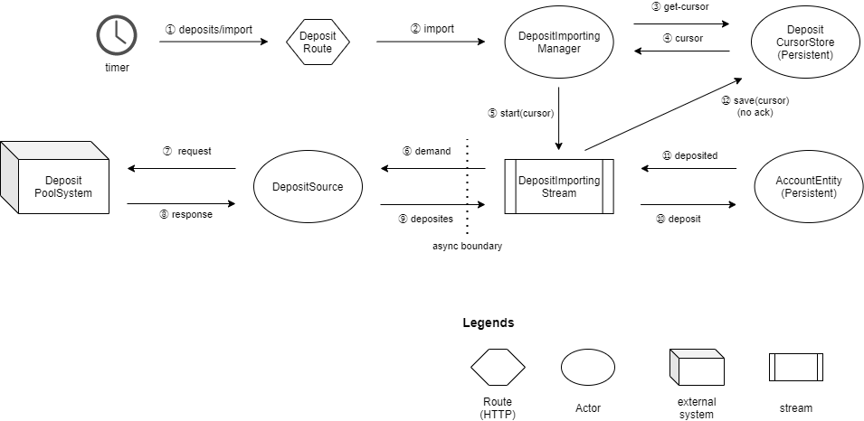
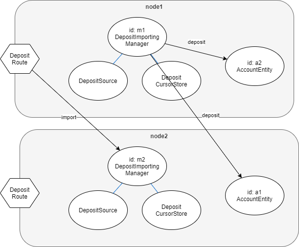

# lerna-sample-account-app

## Archtecture

### コンポーネント

- **timer**
    - cron や systemd.timer などの定期的に処理を起動する仕組み
- **`DepositRoute`**
    - 外部から HTTP リクエストでデータ取り込みの指示を受け付ける
- **`DepositImportingManager`**
    - データ取り込みのライフサイクル（起動・終了など）を管理する
- **`DepositCursorStore`**
    - カーソル（データの範囲を表す情報）を保存する
- **`AccountEntity`**
    - 口座の状態を持つ Entity。入金のコマンドを受け付ける
- **`DepositPoolSystem`**
    - 入金データを溜め込むサブシステム
    - 本サンプルでは WireMock を使って実現
- **`DepositSource`**
    - `DepositPoolSystem` からデータを取得する
- **`DepositImportingStream`**
    - `DepositSource` から受け取ったデータを `AccountEntity` にコマンドで連携する
    - 連携するコマンドの量を流量制御する
    - `AccountEntity` のレスポンスが遅延した場合は排圧制御をかける
    
### 処理の流れ



- ① 特定のタイミングでデータ取り込み用の API をコール
- ② `DepositImportingManager` にインポートが指示されます
- ③④ 保存されたカーソルがあるか確認
- ⑤ カーソルがあれば指定して `DepositImportingStream` (akka-stream) を起動
- ⑥⑨ `DepositSource` からデータを受け取る
- ⑦⑧ `DepositSource` は `DepositPoolSystem` から非同期でデータ取得
- ⑪⑫ 取得したデータを元に `AccountEntity` へコマンド送信

### 分散方式



- `DepositImportingManager` 及びそれが管理するコンポーネントは ClusterSharding で各ノードに分散配置される
- `AccountEntity` も各ノードに分散配置される（`DepositImportingManager` とは別系統）
- 1回の `import` で処理を行う `DepositImportingManager` は一つで、そこから各ノードに配置された `AccountEntity` にコマンドが送信される

## Provisioning environment

`docker-compse` を使用して開発環境を準備できます。

開発環境を構築するには次のコマンドを実行します。  
これによって `MariaDB` と `Cassandra`、`WireMockServer` が起動します。

```shell
docker-compose up -d
```

開発環境で動くサーバ(`MariaDB`等)を停止するには次のコマンドを実行します。

```shell
docker-compose down
```

開発環境を破棄するには次のコマンドを実行します。  
このコマンドで開発環境のデータベースの内容がすべて破棄されます。

```shell
docker-compose down --volumes
```

## Getting started

次のコマンドを実行することで、
コンパイルとユニットテストを実行できます。
ユニットテストを実行するためには開発環境を構築しておく必要があります。

```shell
sbt clean test:compile test
```

アプリサーバを実行するには次の2つのコマンドを別々のシェルで実行します。

```shell
# アプリサーバ1を起動します
./scripts/start-app-1.sh
```

```shell
# アプリサーバ2を起動します
./scripts/start-app-2.sh
```

## API

### アプリサーバー

アプリサーバ1(`127.0.0.1`)にリクエストを送る例です。

```shell
# データ取り込みを起動します
# データ取り込みは非同期で行われるため、すぐに応答が返ります
curl --silent --noproxy "*" http://127.0.0.1:9001/import

# アプリバージョンを取得します
# デフォルトでは unknown になっています
# 設定ファイルや環境変数で上書きすることができます
curl --silent --noproxy "*" http://127.0.0.1:9002/version

# アプリコミットハッシュを取得します
# デフォルトでは unknown になっています
# 設定ファイルや環境変数で上書きすることができます
curl --silent --noproxy "*" http://127.0.0.1:9002/commit-hash
```

アプリサーバ2(`127.0.0.2`)にリクエストを送る場合はIPアドレスを変更します。

```
curl --silent --noproxy "*" http://127.0.0.2:9001/import
curl --silent --noproxy "*" http://127.0.0.2:9002/version
curl --silent --noproxy "*" http://127.0.0.2:9002/commit-hash
```

ポート番号 `9001` は ユーザ向け機能、  
ポート番号 `9002` は 管理用機能を定義することを想定しています。

### WireMockServer

WireMockServer にリクエストを送る例です。

WireMockServer のスタブはアプリによって設定されるため、事前に `sbt run` を実行しておいてください。

```shell
# 入金データを返します
# cursor でデータの開始位置、limit で取得するデータの最大数を指定できます
# cursor を指定しない場合は最も古いデータから limit 分だけデータを返します
curl --silent --noproxy "*" 'http://127.0.0.1:8083/data?limit=10&cursor=100'
```

## テストカバレッジ を取得する

次のコマンドを実行することで、テストカバレッジを取得できます。

```shell
sbt take-test-coverage
```

テストカバレッジは、`./target\scala-2.12\scoverage-report`に出力されます。

## データベースのスキーマを更新する

データベースのスキーマを追加するには次の手順を実行してください。

### 開発環境を破棄する

開発環境を破棄するため次のコマンドを実行してください。

```shell
docker-compose down --volumes
```

### SQL ファイルを追加する
[./docker/mariadb/initdb](./docker/mariadb/initdb) に
テーブル作成やマスターデータ追加などのSQLファイルを追加します。

### 開発環境を再構築する

開発環境を再構築するため次のコマンドを実行してください。

```shell
docker-compose up
```

### Slick スキーマ定義コードを生成する
SQLファイルを追加したあと、対応するSlickのスキーマ定義コードを自動生成するため次のコマンドを実行します。

```shell
sbt slick-codegen/run
```


## RPM パッケージをビルドする
RPM パッケージを作成するためには、次のコマンドを実行します。

```shell
docker-compose run --rm sbt-rpmbuild clean rpm:packageBin
```

RPM ファイルは、`target/rpm/RPMS/noarch/` に作成されます。

### RPM パッケージビルド の注意事項

- RPM パッケージのビルドでは、プロジェクトが `git` で管理されており、
RPM パッケージに含める内容はすべてコミット済みであることが想定されています。
RPM パッケージをビルドする前に、この条件が満たされていることを確認してください。

- RPM パッケージのビルドには [CHANGELOG.md](./CHANGELOG.md) ファイルが必要です。
