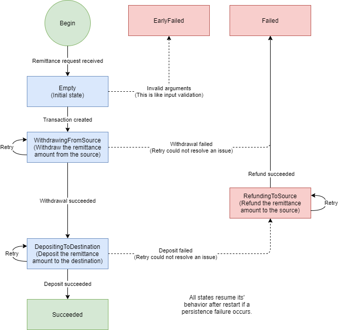

# 送金機能

## 概要
送金は、入金API、出金API、返金API のクライアントとして動作し、送金元口座から送金先口座へ送金処理を行います。
送金には、リクエスト受付済み状態が存在し、クライアントからのリトライが無くても送金処理が完了するようにサーバ内部で処理が非同期的に進行します。
送金は、リクエストに対して同期的なレスポンスを返す要件があり、送金に必要な一連の処理(送金取引と呼ぶ)が完了した場合にのみ、送金成功であるというレスポンスを返します。
送金取引は、送金取引IDを指定することで冪等性を保証できます。

## アーキテクチャ
送金取引は分散トランザクションとなります。
Saga & オーケストレーション パターンで実装しています。
Saga 分散トランザクション の詳細は、
[saga 分散トランザクション - Azure Design Patterns | Microsoft Docs](https://docs.microsoft.com/ja-jp/azure/architecture/reference-architectures/saga/saga)
から確認できます。

送金取引を扱うオーケストレータを送金オーケストレータと呼ぶこととします。
送金オーケストレータは、送金取引ごとに作成され、送金取引が完了するまで動作し続けます。
送金オーケストレータは、
[Cluster Sharding • Akka Documentation](https://doc.akka.io/docs/akka/current/typed/cluster-sharding.html)
の Entity として動作します。
送金オーケストレータの動作は、
[Event Sourcing • Akka Documentation](https://doc.akka.io/docs/akka/current/typed/persistence.html)
を用いて実装されています。

## 送金取引の状態遷移
送金オーケストレータはステートマシンとして表現できます。
送金取引の状態遷移図は次のようになります。

送金取引の状態は永続化ストレージに保存されます。
送金オーケストレータは、 永続化失敗が人手によるストレージ復旧作業によって回復されることを期待しており、
永続化失敗に遭遇すると成功するまで回数上限無しでリトライします。

## ソースコード
* [RemittanceOrchestratorBehavior.scala](../../app/application/src/main/scala/myapp/application/account/RemittanceOrchestratorBehavior.scala)
* [RemittanceApplicationImpl.scala](../../app/application/src/main/scala/myapp/application/account/RemittanceApplicationImpl.scala)
* [RemittanceOrchestratorBehaviorSpec](../../app/application/src/test/scala/myapp/application/account/RemittanceOrchestratorBehaviorSpec.scala)
