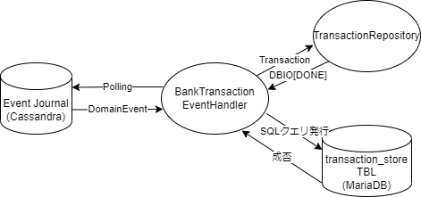

# 入出金明細出力機能

## 概要
入出金明細出力APIは指定された口座に紐づく過去の入出金取引履歴(入金、出金、返金)の一覧を返します。

## アーキテクチャ
銀行口座アプリケーションでは [CQRS](https://docs.microsoft.com/en-us/azure/architecture/patterns/cqrs) と
[Event Sourcing](https://doc.akka.io/docs/akka/current/typed/persistence.html)
が採用されており、入金APIや出金APIなどが処理を行うときに発生する入出金イベントは Write DB に保存され、
入出金明細出力 API では Read DB からデータを取得しています。
銀行口座アプリケーションでは Write DB に Cassandra、 Read DB に MariaDB を使用しています。

Read DB のデータを更新するために
[Akka Projection](https://doc.akka.io/docs/akka-projection/current/overview.html)
が使われており、Write DB に書き込まれるイベントを利用して Read DB の更新を行っています。

## ソースコード
* [AppEventHandler.scala](../../app/application/src/main/scala/myapp/application/projection/AppEventHandler.scala)
* [BankTransactionEventHandler.scala](../../app/application/src/main/scala/myapp/application/projection/transaction/BankTransactionEventHandler.scala)
